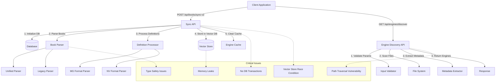
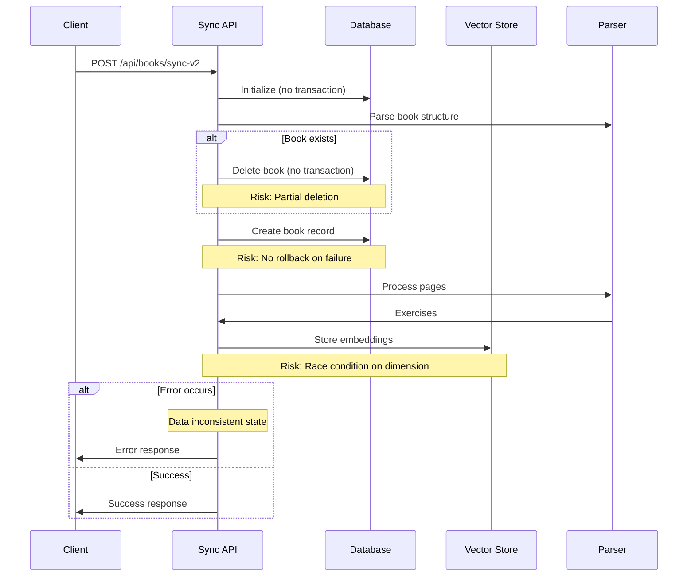
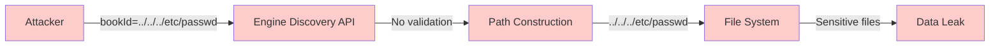
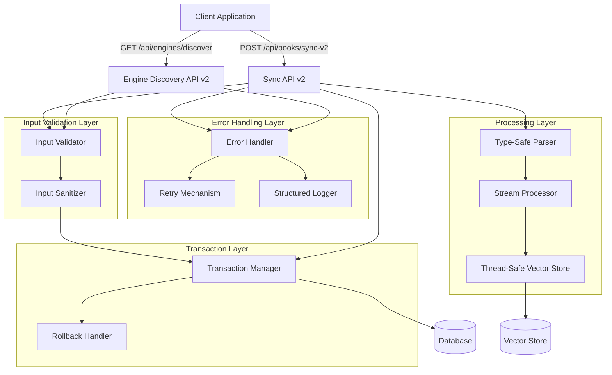
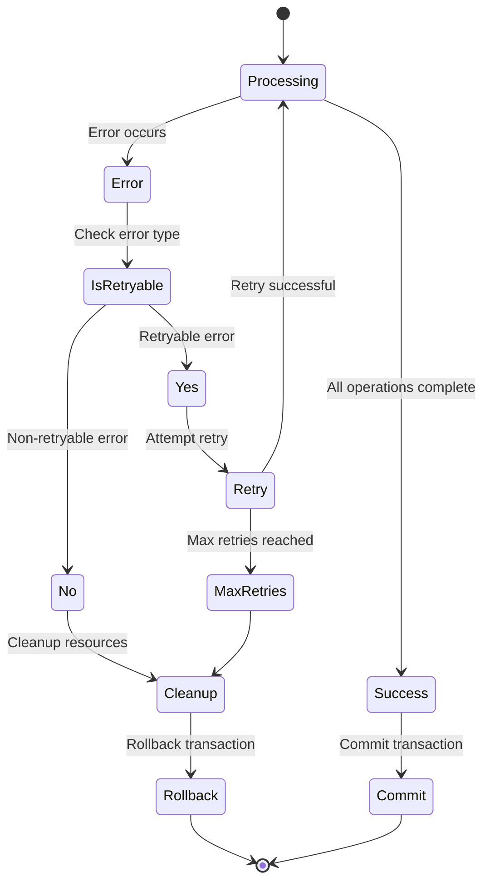

# API Architecture and Issues Visualization

## Current Architecture Flow



## Data Flow Issues



## Security Vulnerability Flow



## Proposed Fixed Architecture



## Error Recovery Flow



## Performance Optimization Flow

```mermaid
graph LR
    Input[Large Book Input] --> Chunker[Chunker]
    Chunker --> |Chunks| Queue[Processing Queue]
    Queue --> Worker1[Worker 1]
    Queue --> Worker2[Worker 2]
    Queue --> WorkerN[Worker N]
    
    Worker1 --> |Processed| Collector[Result Collector]
    Worker2 --> |Processed| Collector
    WorkerN --> |Processed| Collector
    
    Collector --> |Stream| Client[Client Updates]
    
    subgraph "Memory Management"
        GC[Garbage Collection]
        Pool[Object Pool]
    end
    
    Worker1 --> GC
    Worker2 --> GC
    WorkerN --> GC
    Queue --> Pool