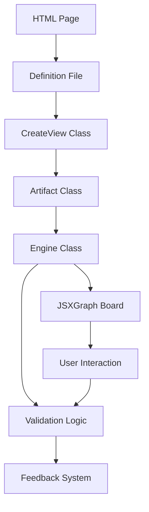

# Mathematical Books System Architecture Analysis

## Overview
This document provides a comprehensive analysis of how the mathematical books system works in the math-agent-front-v1 project. The system consists of two main mathematical books (MG and NV) that contain interactive mathematical artifacts rendered on web pages.

## System Architecture

### 1. Book Structure
Both MG and NV books follow a similar organizational structure:

```
books/
├── MG/                    # Mathematics Guide book
│   └── book/
│       ├── assets/         # SVG assets and images
│       ├── css/           # Stylesheets organized by chapter
│       ├── definitions/    # JavaScript definitions for each page
│       ├── library/        # Third-party libraries (JSXGraph, MathLive, etc.)
│       ├── mobile/         # Mobile-specific HTML views
│       └── views/          # Desktop HTML views (EJS templates)
└── NV/                    # New Version book
    └── book/
        ├── assets/         # Assets and resources
        ├── css/           # Stylesheets
        ├── definitions/    # JavaScript definitions
        ├── library/        # Libraries
        └── mobile/         # Mobile views
```

### 2. Core Components

#### 2.1 Definition Files
Definition files (`.js`) contain the mathematical content and exercise configurations:

- **Artifact Definitions**: Define interactive mathematical elements
- **Board Definitions**: Configure JSXGraph boards with points, lines, curves
- **Conditions**: Validation rules for exercises
- **Questions**: For quizzes and interactive elements

Example structure:
```javascript
const def = {
  artifact_1: {
    board: "board_1",
    engine: HorizontalSegment,
    parent: "lexico-content",
    conditions: {
      intervals: {
        inputs: {
          text: "Error message",
          values: [["5"]],
        },
      },
    },
  },
};
```

#### 2.2 Engine System
The system uses a modular engine architecture:

- **BaseEngine**: Abstract base class with common functionality
- **Specific Engines**: Implement different mathematical interactions
  - `HorizontalSegment`: For interval representations
  - `EngineOwner`: General purpose engine
  - `engineInterval`: For interval operations
  - And others for specific mathematical concepts

#### 2.3 Rendering Pipeline

1. **HTML Templates**: Define the basic structure
2. **JavaScript Engines**: Initialize and manage interactions
3. **JSXGraph**: Renders mathematical graphs
4. **MathLive**: Provides mathematical input fields
5. **Validation**: Checks user inputs against conditions

### 3. Mathematical Artifact Types

#### 3.1 Interactive Graphs
- Uses JSXGraph library for rendering
- Supports points, lines, curves, and shapes
- Interactive elements with drag/drop functionality

#### 3.2 Mathematical Input
- MathLive integration for LaTeX input
- Custom keyboards for mathematical symbols
- Real-time validation and feedback

#### 3.3 Assessment Components
- Multiple choice questions
- Interactive validation
- Progress tracking
- Rating systems

### 4. Key Libraries and Dependencies

#### 4.1 Core Libraries
- **JSXGraph**: Interactive geometry visualization
- **MathLive**: Mathematical input and rendering
- **ComputeEngine**: Mathematical computations
- **Babel**: JavaScript transpilation

#### 4.2 UI Libraries
- **Bootstrap**: UI components
- **Custom CSS**: Book-specific styling
- **Responsive Design**: Mobile/desktop adaptations

### 5. Data Flow



### 6. Key Features

#### 6.1 Interactive Mathematics
- Dynamic graph manipulation
- Real-time validation
- Mathematical symbol input
- Visual feedback

#### 6.2 Assessment System
- Multiple question types
- Progress tracking
- Correct/incorrect feedback
- Time tracking

#### 6.3 Responsive Design
- Mobile-specific views
- Adaptive layouts
- Touch-friendly interactions

### 7. Differences Between MG and NV Books

#### MG (Mathematics Guide)
- More comprehensive mathematical content
- Advanced interactive features
- Complex graph manipulations
- Extensive validation logic

#### NV (New Version)
- Simplified interface
- Focused on core concepts
- Cleaner design
- Streamlined interactions

### 8. Technical Implementation Details

#### 8.1 Class Hierarchy
```
BaseEngine
├── EngineOwner
├── Specific Engines (HorizontalSegment, etc.)
└── Validation Classes
```

#### 8.2 Event Handling
- Mouse/touch events for interactions
- Keyboard input handling
- Custom event dispatching
- State management

#### 8.3 Validation System
- Pattern matching for mathematical expressions
- Multiple valid answers support
- Partial credit handling
- Error messaging

### 9. Mobile Optimization
- Responsive layouts
- Touch-optimized controls
- Simplified interfaces
- Performance optimizations

### 10. Extensibility
The system is designed to be extensible:
- New engines can be added
- Custom validation rules
- Additional mathematical components
- Modular CSS architecture

## Conclusion

This mathematical books system represents a sophisticated approach to interactive mathematics education. It combines powerful visualization libraries with custom engines to create engaging, validated mathematical exercises. The modular architecture allows for easy extension and maintenance while providing a consistent user experience across different mathematical topics and difficulty levels.

The system effectively separates concerns between:
- Content (definitions)
- Presentation (HTML/CSS)
- Logic (engines)
- Visualization (JSXGraph)
- Input (MathLive)

This separation enables content creators to focus on mathematical content while developers can enhance the technical implementation independently.